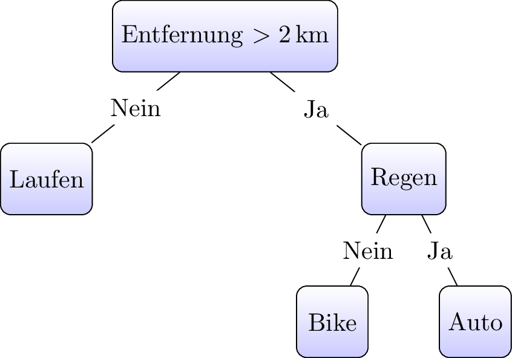
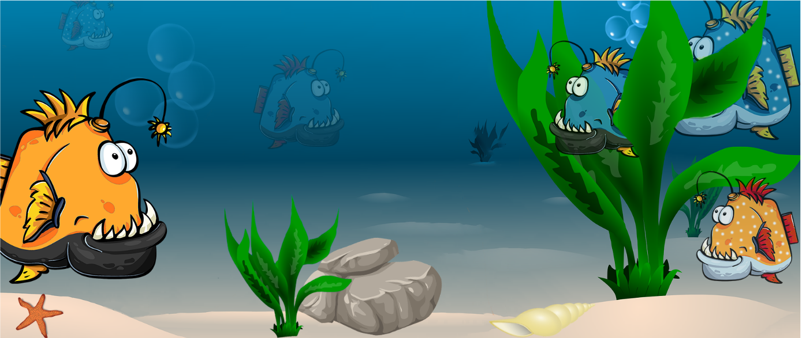
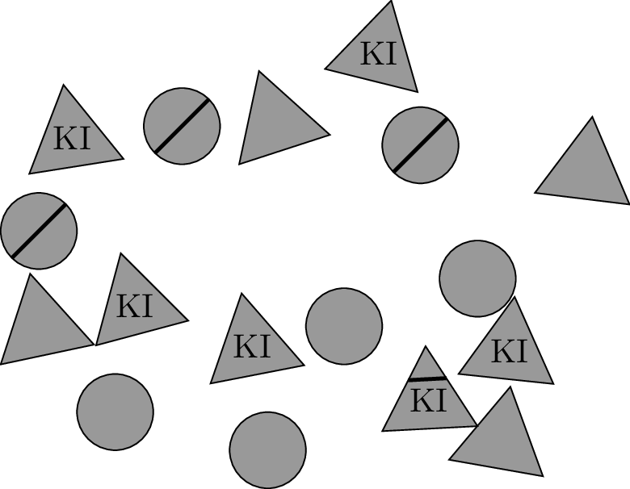
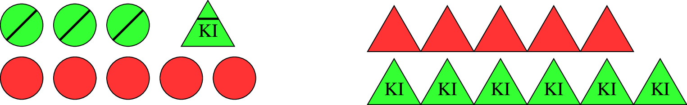
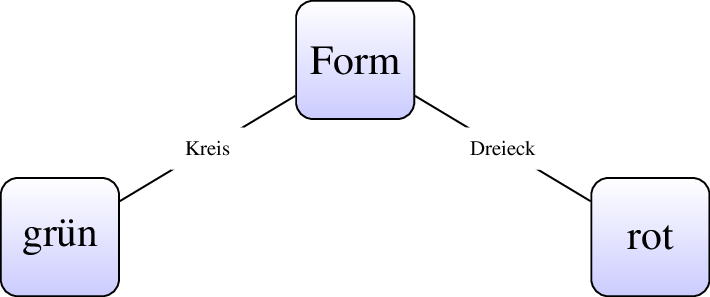
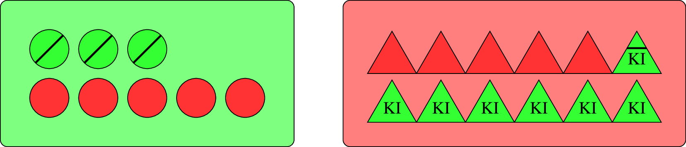
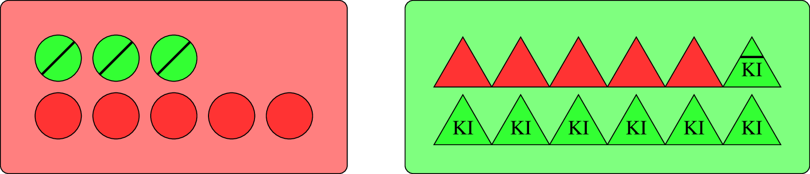
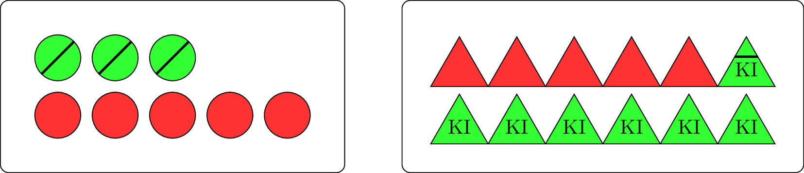
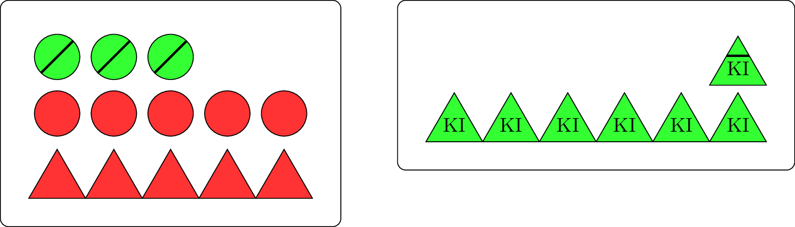

## Welches Fortbewegungsmittel?

------------------------------------------------------------------------

Dieser *fertige* Baum kann verwendete werden ...

::: {.fragment .absolute top="100"}
... das entspricht der *Verwendung der KI*
:::

::: {.fragment .absolute top="250"}
Das *Erstellen* des Baums ...
:::

::: {.fragment .absolute top="350"}
... entspricht dem *Training der KI*
:::

------------------------------------------------------------------------

## Woher kommen die Trainingsdaten?

- Umfragen in Firmen
- Umfragen in Sportgeschäften
- Auswerten von Fitness-Trackern (legal?)
- ...

::: fragment
Trainingsdaten und Datenschutz kollidieren oft!
:::

------------------------------------------------------------------------

## Problem Baumerstellung

Es gibt nicht nur eine einzige Methode!

- manche sind leichter verständlich
- manche rechnen sich leichter per Hand
- manche existieren bereits vorgefertigt
- ...

------------------------------------------------------------------------

Im Kern sind viele Abläufe gleich, Unterschiede liegen in den Details.

------------------------------------------------------------------------

## Generelle Frage

**... wollen wir Bäume? ... wollen wir KI?**

---

## Szenario Orchideen

Klassiker aus dem Bereich *Maschinelles Lernen*.

:::{.smaller}
| Sepal Length | Sepal Width | Petal Length | Petal Width | Species         |
|-------------:|------------:|-------------:|------------:|-----------------|
| 5.1 | 3.5 | 1.4 | 0.2 | Iris-setosa     |
| 4.9 | 3.0 | 1.4 | 0.2 | Iris-setosa     |
| 4.7 | 3.2 | 1.3 | 0.2 | Iris-setosa     |
| 6.8 | 3.2 | 5.9 | 2.3 | Iris-virginica  |
| 6.7 | 3.3 | 5.7 | 2.5 | Iris-virginica  |
| 6.7 | 3.0 | 5.2 | 2.3 | Iris-virginica  |
| 6.3 | 2.3 | 4.4 | 1.3 | Iris-versicolor |
| 5.6 | 3.0 | 4.1 | 1.3 | Iris-versicolor |
| 5.5 | 2.5 | 4.0 | 1.3 | Iris-versicolor |
:::

:::{.small}
Sepal = Kelchblatt, Petal = Blütenblatt
:::

---

* Die Namen der Orchideen-Art nennt man *Label* der Daten.
* Die Daten werden als Baum strukturiert.  
* Damit können Orchideen klassifiziert werden, die der Benutzer nicht kennt.
* Die *exakten* Werte müssen nicht in den Daten auftreten!
* Nach welchen Attributen in welcher Reihenfolge wird der Baum gebaut?

## Szenario Abitur

* Die Schule sammelt über Jahre Daten aller Schüler in allen Fächern  
* KI wertet sie aus und erstellt einen Entscheidungsbaum 
* Die aktuellen Daten eines Schülers werden in den Baum gefüttert
* Am Ende stehen die (wahrscheinlichen) Abiturnoten
* Viel Arbeit gespart - beiden Seiten!

## Details - vereinfacht

:::{.smaller}
| SuS | Fach  | Fehlzeit \> 10 % | Übungen \> 50 % | Bestanden |
|-----|-------|------------------|-----------------|-----------|
| 1   | Mathe | Ja               | Ja              | Nein      |
| 2   | Ethik | Ja               | Ja              | Ja        |
| 3   | IT    | Nein             | Nein            | Ja        |
| 4   | Mathe | Nein             | Nein            | Nein      |
| 5   | Mathe | Nein             | Ja              | Ja        |
| 6   | IT    | Ja               | Nein            | Nein      |
| 7   | Ethik | Nein             | Nein            | Ja        |
| 8   | Ethik | Nein             | Nein            | Ja        |
| 9   | IT    | Ja               | Ja              | Ja        |
:::

---

**Verschiedene Ziele:**

* Orchideen: Klassifizieren (Einordnen) 
* Abiturnoten: Regression (Wertevorhersage)
* Bestanden: Klassifizieren
* Wetterbericht: 
* Hautkrebs-Screening:
* Aktien:

---

## Problem Daten

* Unabhängig von der Art von KI müssen Trainingsdaten aufbereiten werden.
* Große KI's werden mit gigantischen Datenmengen trainiert ... 
* ... hoher Aufbereitungsaufwand.

---

**Fehlende Werte (Missing Values)**

* Leere Felder erkennen
* Werte entfernen oder ersetzen   
  (z. B. durch Mittelwert, Median)

. . .

**Duplikate**

:::{.fragment}
Doppelte Datensätze identifizieren und entfernen
:::

---

**Ungültige oder fehlerhafte Werte**

* Tippfehler, falsche Kategorien, unmögliche Werte korrigieren (Alter = −5)

. . .

**Ausreißer (Outliers)**

:::{.fragment}
Ungewöhnlich hohe oder niedrige Werte erkennen und prüfen
:::

. . .

**Inkonsistente Formate**

:::{.fragment}
Einheitliche Schreibweisen herstellen  
„m“, „M“, „male“, ... **Eine** Version!
:::

---

**Datentypen korrigieren**

:::{.fragment}
Zahlen, Datumswerte und Text in die richtigen Formate umwandeln
:::

. . .

**Skalierung und Normalisierung**

:::{.fragment}
Numerische Merkmale auf vergleichbare Wertebereiche bringen
:::

. . .

**Kategorische Werte bereinigen**

:::{.fragment}
Kategorien vereinheitlichen und für ML vorbereiten (z. B. Encoding)
:::

---

**Irrelevante Merkmale entfernen**

:::{.fragment}
Nicht benötigte Spalten oder Informationen löschen
:::

. . .

**Konsistenzprüfung**

* Beziehungen zwischen Attributen überprüfen
* Beispiel: Enddatum darf nicht vor dem Startdatum liegen

## Erstellen eines Baumes

ARBEITSPHASE

## Analytisches Vorgehen

------------------------------------------------------------------------

## Problem

Ordne die Figuren nach *rot* und *grün*.

{width="50%"}

------------------------------------------------------------------------

## Wir wissen mehr ...

10 rot, 10 grün

------------------------------------------------------------------------

## Gesucht wird ein Entscheidungsbaum

Der Computer soll über Form und Inhalt die Farbe erkennen.

------------------------------------------------------------------------

Welche Eigenschaft als *Selector*?

::: incremental
- Form
- Striche
- Text
:::

------------------------------------------------------------------------

## Mathematischer Ansatz

Wenn der Computer *rät* hat er eine Trefferquote von ...

. . .

$50\%$

------------------------------------------------------------------------

Bei Trennung nach Form?

{.absolute top="100" left="200"}

. . .

{.absolute top="400" left="70"}

::: {.absolute style="position:absolute; top:150px; left:400px;"}
$\frac{8}{20}$
:::

::: {.absolute style="position:absolute; top:150px; left:670px;"}
$\frac{12}{20}$
:::

. . .

::: {.absolute style="position:absolute; top:630px; left:70px;"}
Korrekt: $\frac{3}{8}$
:::

::: {.absolute style="position:absolute; top:630px; left:300px;"}
Falsch: $\frac{5}{8}$
:::

. . .

::: {.absolute style="position:absolute; top:630px; left:580px;"}
Korrekt: $\frac{5}{12}$
:::

::: {.absolute style="position:absolute; top:630px; left:820px;"}
Falsch: $\frac{7}{12}$
:::

------------------------------------------------------------------------

Korrekt:

$$P(korrekt)=\frac{8}{20} \cdot \frac{3}{8} + \frac{12}{20} \cdot \frac{5}{12} = \frac{3}{20}+\frac{5}{20} = \frac{8}{20} = 0,4$$

$$P(falsch)=\frac{8}{20} \cdot \frac{5}{8} + \frac{12}{20} \cdot \frac{7}{12} = \frac{5}{20}+\frac{7}{20} = \frac{12}{20} = 0,6$$

Mit 60% Wahrscheinlichkeit liegt die KI falsch!

------------------------------------------------------------------------

## Arbeitsauftrag

Welche Wahrscheinlichkeiten entstehen bei der gegenteiligen Entscheidung?

------------------------------------------------------------------------

------------------------------------------------------------------------

Bei Trennung nach Form?

{.absolute top="100" left="200"}

. . .

{.absolute top="400" left="70"}

::: {.absolute style="position:absolute; top:150px; left:400px;"}
$\frac{8}{20}$
:::

::: {.absolute style="position:absolute; top:150px; left:670px;"}
$\frac{12}{20}$
:::

. . .

::: {.absolute style="position:absolute; top:630px; left:70px;"}
Korrekt: $\frac{5}{8}$
:::

::: {.absolute style="position:absolute; top:630px; left:300px;"}
Falsch: $\frac{3}{8}$
:::

. . .

::: {.absolute style="position:absolute; top:630px; left:580px;"}
Korrekt: $\frac{7}{12}$
:::

::: {.absolute style="position:absolute; top:630px; left:820px;"}
Falsch: $\frac{5}{12}$
:::

------------------------------------------------------------------------

Korrekt:

$$P(Korrekt) = \frac{8}{20} \cdot \frac{5}{8} + \frac{12}{20} \cdot \frac{7}{12} = \frac{5}{20}+\frac{7}{20} = \frac{12}{20} = 0,6$$ $$P(Falsch) = \frac{8}{20} \cdot \frac{3}{8} + \frac{12}{20} \cdot \frac{5}{12} = \frac{3}{20}+\frac{5}{20} = \frac{8}{20} = 0,4$$

Mit 40% Wahrscheinlichkeit liegt die KI falsch!

------------------------------------------------------------------------

## Erkenntnis

Bei der Wahl „Welche Seite wird grün?“\
wird die *Mehrheitsklasse* verwendet.

(rot analog)

{.absolute top="400" left="70"}

## Warum mit der Form beginnen?

**Exerziere das Beispiel komplett mit der Entscheidung *Text* durch.**

## (Mit *Muster* als freiwillige Übung)

## Beschriftung

{.absolute top="100" left="70"}

. . .

::: {.absolute style="position:absolute; top:400px; left:70px;"}
Die Wahl wäre links rot, rechts grün.
:::

. . .

::: {.absolute style="position:absolute; top:450px; left:70px;"}
$$P(korrekt)=\frac{13}{20} \cdot \frac{10}{13} + \frac{7}{20} \cdot \frac{7}{7} = \frac{10}{20}+\frac{7}{20} = \frac{17}{20} = 0,85$$
:::

::: {.absolute style="position:absolute; top:570px; left:70px;"}
$$P(falsch)=\frac{13}{20} \cdot \frac{3}{13} + \frac{7}{20} \cdot \frac{0}{7} = \frac{10}{20}+0 = \frac{3}{20} = 0,15$$
:::

------------------------------------------------------------------------

## Was fällt auf?

Die Wahrscheinlichkeiten sind beim Aufbau des Baums gar nicht so wichtig!

Zählen reicht!

------------------------------------------------------------------------

# Anderes Vorgehen

------------------------------------------------------------------------

**Die Daten als Tabelle (nach Form sortiert) = 2 Gruppen**

::: {.smaller .absolute left="10px"}
| Form    | Beschriftung | Muster | Farbe |
|---------|--------------|--------|-------|
| Dreieck | Ja           | Nein   | Grün  |
| Dreieck | Ja           | Nein   | Grün  |
| Dreieck | Ja           | Nein   | Grün  |
| Dreieck | Ja           | Nein   | Grün  |
| Dreieck | Ja           | Nein   | Grün  |
| Dreieck | Ja           | Nein   | Grün  |
| Dreieck | Ja           | Ja     | Grün  |
| Dreieck | Nein         | Nein   | Rot   |
| Dreieck | Nein         | Nein   | Rot   |
| Dreieck | Nein         | Nein   | Rot   |
| Dreieck | Nein         | Nein   | Rot   |
| Dreieck | Nein         | Nein   | Rot   |
:::

::: {.smaller .absolute left="500px"}
| Form  | Beschriftung | Muster | Farbe |
|-------|--------------|--------|-------|
| Kreis | Nein         | Ja     | Grün  |
| Kreis | Nein         | Ja     | Grün  |
| Kreis | Nein         | Ja     | Grün  |
| Kreis | Nein         | Nein   | Rot   |
| Kreis | Nein         | Nein   | Rot   |
| Kreis | Nein         | Nein   | Rot   |
| Kreis | Nein         | Nein   | Rot   |
| Kreis | Nein         | Nein   | Rot   |
:::

::: {.fragment .small .absolute left="500px" top="600px"}
Häufigstes Label jeder Gruppe finden
:::

::: {.fragment .small .absolute left="300px" top="550px"}
Grün
:::

::: {.fragment .small .absolute left="800px" top="400px"}
Rot
:::

::: {.fragment .small .absolute left="400px" top="200px"}
7
:::

::: {.fragment .small .absolute left="860px" top="300px"}
5
:::

::: {.fragment .small .absolute left="950px" top="400px"}
$\displaystyle{\frac{12}{20}}$ Trefferquote
:::

------------------------------------------------------------------------

- **Wiederhole das für jedes Attribut**
- **Wähle Attribut mit höchster Trefferquote**

------------------------------------------------------------------------
