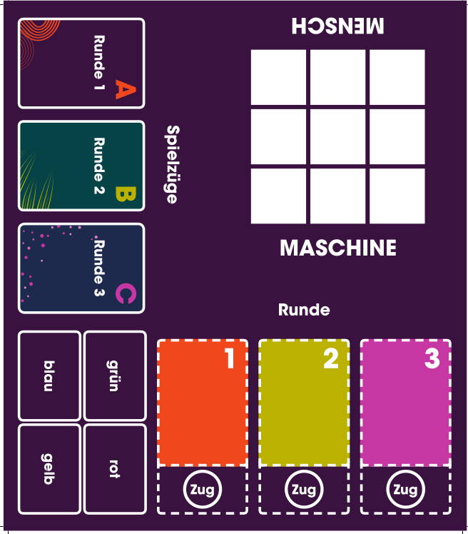
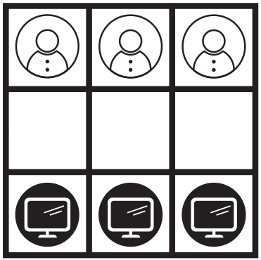
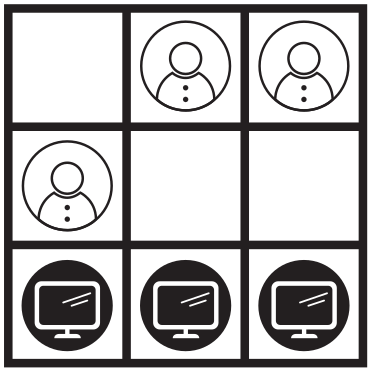
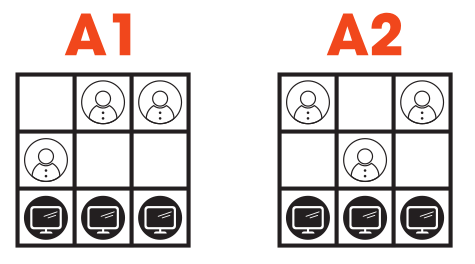
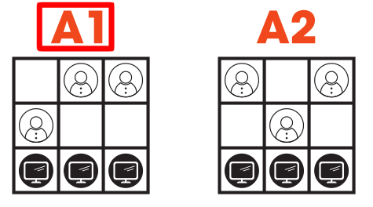
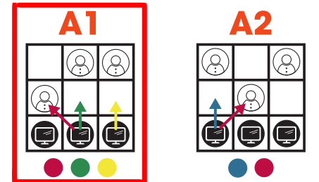

------------------------------------------------------------------------

## Täglicher Kontakt mit KI ...

-   Suchmaschinen

-   Sprachassistenten

-   Navigationssysteme

-   Streaming-Dienste

-   Online-Shops

-   Übersetzungsprogramme

-   Chatbots

:::{.fragment .absolute top="100pt" left="500pt"}
Alles Beispiele für **schwache** KI
:::

------------------------------------------------------------------------

## Schwache KI - starke KI

Schwache KI:

:::{.smaller}
- Wird trainiert und kann nur Probleme lösen, für die sie trainiert wurde.
- KI-Modell ist nach dem Training *fest* und verändert sich nicht mehr.
:::

Starke KI:

:::{.smaller}
- *Lernt* während der Nutzung. 
- Wird unberechenbar (noch unberechenbarer)
- Nicht auf ein Problemfeld beschränkt ($\rightarrow$ Superintelligenz möglich)
:::

. . .

:::{.absolute top="300px" left="600px" .red}
Gibt es aktuell nicht!
:::

## Was ist Künstliche Intelligenz?

KI ist nicht sauber *definiert*, da es auch *Intelligenz* nicht ist!

---

Systeme zur Lösung von Aufgaben,   
für die normalerweise menschliche Intelligenz benötigt wird.

Beispiele:

-   Sprache verstehen

-   Bilder erkennen

-   Texte erzeugen

-   Entscheidungen unterstützen

------------------------------------------------------------------------

## Für uns wichtiger ...

**Wie lernt eine KI?**

KI-Systeme lernen durch:

-   große Datenmengen

-   viele Beispiele

-   Rückmeldungen über richtige und falsche Ergebnisse

:::{.fragment}
Sagt nicht darüber aus **wie** gelernt wird!
:::

---

**Beispiel:**

Eine KI sieht Millionen Bilder von Katzen und Hunden und lernt typische Merkmale zu unterscheiden.

:::{.fragment}
Sagt auch nicht **wie** gelernt wird!
:::

---

## Du als KI

# Bauernschach

---

## Spielfeld

{height=500px}

:::{.fragment .absolute top="100" left="700"}

:::

:::{.fragment .absolute top="100" left="700"}

:::

---

**Aus der Situationsübersicht ablesen**

:::{.fragment .absolute top="100" left="100"}

:::

:::{.fragment .absolute top="100" left="100"}

:::

---

**Aus der Zugübersicht ablesen**

:::{.fragment .absolute top="100" left="100"}

:::

:::{.fragment .absolute top="100" left="650"}
Zufällig eine der erlaubten Farben wählen (r, g, y)
:::

---

## Nun zieht der Mensch ... mit Intelligenz

---

## Spielende (Eine Runde)

* Kein Zug mehr möglich (verloren)
* Gegenüberliegende Seite erreicht (gewonnen)
* alle Figuren verloren (verloren)

---

## Am Runden-Ende

* Gewinner notieren
* Hat der Computer verloren, so wird der letzte Zug auf der 
  Zugkarte gestrichen (Farbe vorsichtig entwerten) und darf  
  nicht mehr verwendet werden.

---

# Spielen

